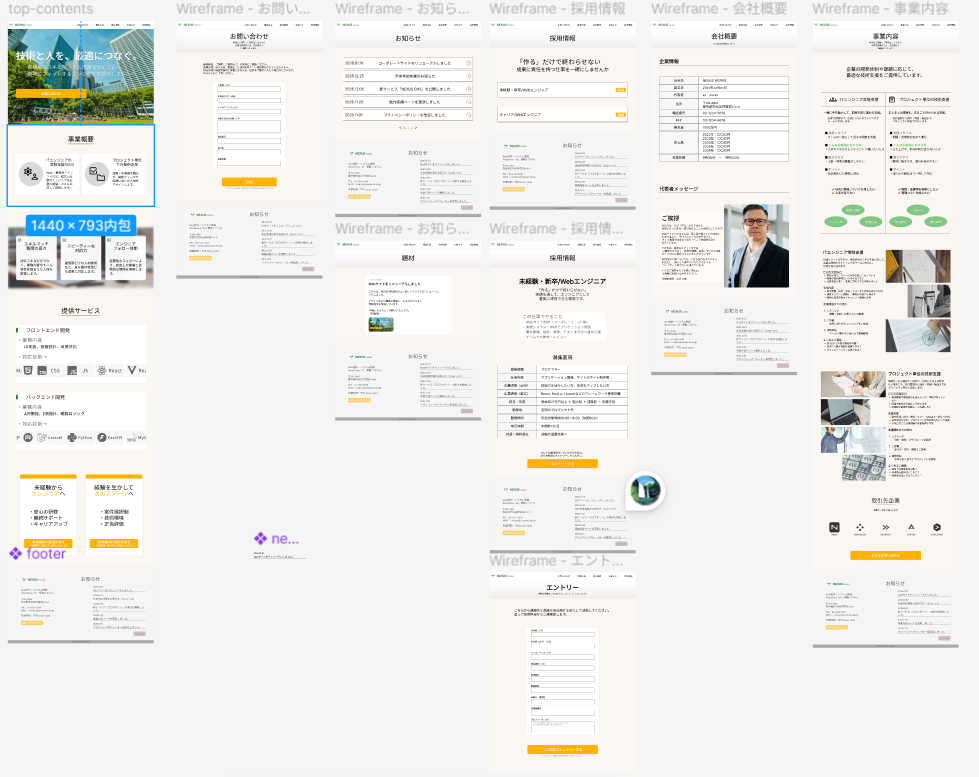

# SES Site WordPress Theme

## 概要
SES企業サイトを想定して制作しているWordPressテーマです。  
現在開発途中（WIP）で、レイアウト構築とUI実装を中心に進めています。

## 実装状況
- Header / Navigatiさい
- ファーストビュー
- CTAボタン
- Swiperスライダー導入
- レスポンシブ対応（途中）

※ 最新の開発内容は `develop` ブランチにあります。

## 使用技術
- HTML
- CSS
- JavaScript
- WordPress
- Swiper.js

## ローカルでの確認方法
wp-content/themes/ に本フォルダを配置し、
WordPress管理画面からテーマを有効化してください。

## 工夫した点
- レスポンシブ設計を前提としたレイアウト構成
- UI操作時の視認性を意識したアニメーション設計
- 再利用性を考慮したCSS設計

## 今後の実装予定
- 下層ページ追加
- コンポーネント分割
- パフォーマンス最適化

- ## Design

Figmaで作成したデザインカンプです。  
本カンプを基にUI実装を行っています。

---

## Pages
本サイトは以下ページ構成で設計・実装しています。

- Top
- About
- Service
- News
- Recruit
- Contact

---

## Implementation Notes
- デザインカンプを元にピクセル精度を意識して実装
- レスポンシブ前提レイアウト設計
- 再利用性を考慮したCSS設計
